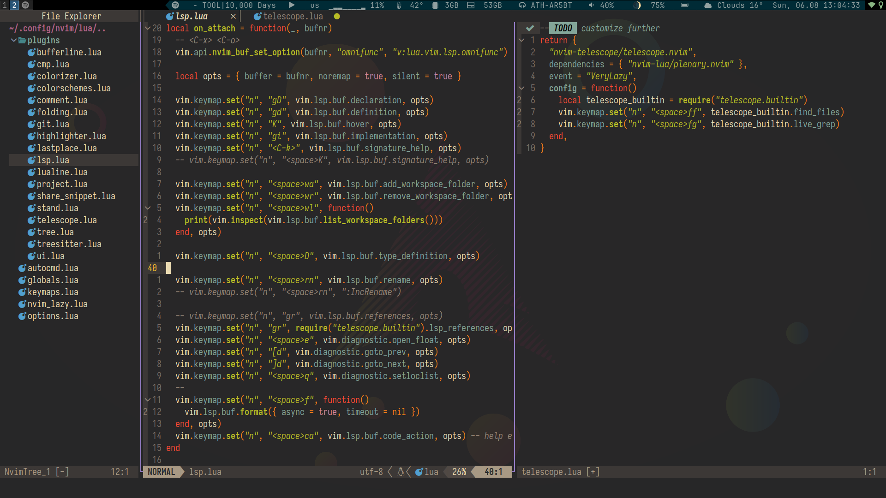

# About

dotfiles managed as git bare repo.
[More about it](https://wiki.archlinux.org/index.php/Dotfiles#Tracking_dotfiles_directly_with_Git)

## Installation

```bash
cd ~/
git clone --bare https://github.com/osauldmy/dotfiles ~/.config/dotfiles
alias dotfiles='GIT_DIR="$HOME"/.config/dotfiles GIT_WORK_TREE="$HOME"'
dotfiles git status
dotfiles git reset
dotfiles git checkout . # possibly fix conflicts if you already have some settings
dotfiles git submodule init
dotfiles git submodule update
dotfiles pre-commit install # optional, but very very recommended
rm README.md && dotfiles git update-index --assume-unchanged README.md # optional
```

## Things I use

```
OS: Arch Linux(i3wm, rofi), MacOS
Shell: zsh
Terminal: alacritty
Terminal font: Iosevka
Editor: neovim (with LSPs and a bunch of plugins like telescope, treesitter, ...)
```

---


